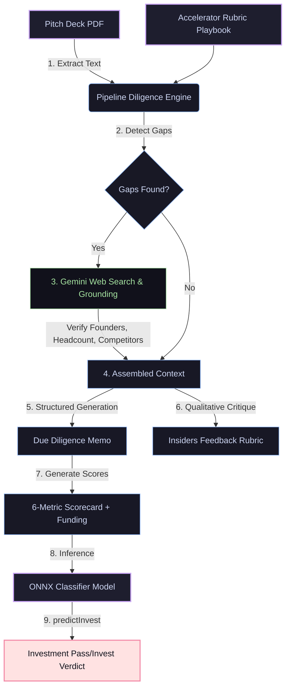

# 🔬 VC Analyst

<p align="center">
  
</p>

<h1 align="center">VC Analyst</h1>

<p align="center">
  <strong>An AI-powered Venture Capital due diligence engine.</strong> Evaluates pitch decks, performs deep web research to verify claims, critiques decks using real accelerator rubrics, and runs scorecard metrics through an in-process trained ONNX machine learning model.
</p>

<p align="center">
  <a href="https://nextjs.org"></a>
  <a href="https://tailwindcss.com"></a>
  <a href="https://onnxruntime.ai"></a>
  <a href="https://typescriptlang.org"></a>
</p>

---

## 🎬 Demo

> [!TIP]
> *Watch the AI VC Analyst stream its due diligence workspace, perform live web queries, and predict investment outcomes in real time.*

| ⏳ Live Due Diligence Stream | 📊 ONNX Prediction & Scorecard |
| :---: | :---: |
|  |  |

---

## 🛠 How It Works

VC Analyst is based on a real-life playbook developed while reviewing **800+ pitch decks** at **Plug and Play Tech Center**, one of the world's most active accelerators. 



---

## 🚀 Key Features

*   **📂 PDF Pitch Deck Parsing**
    Extracts core startup features, metrics, and team credentials from uploaded PDF pitch decks.
*   **🌐 Grounded Web Research**
    Uses Google Search grounding via Gemini to verify claims, search founder LinkedIn/GitHub profiles, assess competitive overlap, and fill missing deck parameters.
*   **📋 Structured Due Diligence Report**
    Generates a full due diligence memo covering Company Identity, Founders & Cap Table, Team Runway, Problem & Insight, Solution Defensibility, and Market GTM.
*   **📢 Feedback Rubric**
    Flags critical issues, warnings, and strengths (e.g., founder complementarity, full-time commitment, website discoverability, and realistic competitive maps) derived from real accelerator reviews.
*   **🧠 ONNX ML Scoring & Inference**
    Scores the startup on 6 metrics (Team, Tech, Market Size, Value Prop, Competition, Social Impact) and feeds them into an in-process, trained HistGradientBoosting classifier via `onnxruntime-node` to predict investment verdicts.
*   **⚡ Live Streaming Dashboard**
    An interactive dashboard that streams progress, search queries, research logs, and generated fields in real time using NDJSON.
*   **💸 Real-time Cost Estimation**
    A Dev Cost Sidebar calculating prompt and completion token costs across model tiers (economy vs. reasoning/web-search passes) to monitor AI expenses.

---

## 📐 Playbook Rubric & Custom ML Model

### 1. The Rubric
Instead of generic AI advice, VC Analyst judges pitch decks against a strict, battle-tested accelerator template:
*   **Team Complementarity:** Evaluates whether there's a balanced split of engineering and business/domain expertise.
*   **Founder Commitment:** Highlights paths to full-time commitment and identifies part-time risks.
*   **Competitive Authenticity:** Penalizes startups claiming "no competition," looking for true differentiators.
*   **Discoverability:** Verifies if key founders are verifiable online (LinkedIn, publications, GitHub).

### 2. ONNX Classifier
The investment verdict is determined by a **HistGradientBoosting** model trained on a historical database of 800+ evaluated deals. The model is exported to ONNX format (`lib/invest/model.onnx`) and run locally:
```typescript
// Features fed into model.onnx in exact order:
[
  TeamScore,            // 1-5
  TechnologyScore,      // 1-5
  MarketSizeScore,      // 1-5
  ValuePropScore,       // 1-5
  CompetitionScore,     // 1-5
  SocialImpactScore,    // 1-5
  FundingRaisedToDate   // Numeric integer
]
```

---

## 💻 Tech Stack

- **Framework**: [Next.js 16](https://nextjs.org/) (App Router, Tailwind CSS v4)
- **AI Models**: 
  - [Google Gemini API](https://ai.google.dev/) (via `@google/genai` for web-grounded research)
  - [Anthropic Claude API](https://anthropic.com/) (via `@anthropic-ai/sdk` for structured memo writing)
- **ML Runtime**: [ONNX Runtime Node](https://onnxruntime.ai/) (`onnxruntime-node`)
- **PDF Processor**: `unpdf` (using PDF.js underneath for fast server-side text extraction)

---

## ⚙️ Setup & Installation

### 1. Prerequisites
Make sure you have Node.js (v18+) and your API keys ready.

### 2. Clone the Repository
```bash
git clone https://github.com/william-popmie/vc-analyst.git
cd vc-analyst
```

### 3. Configure Environment Variables
Create a `.env` file in the root directory (you can copy `.env.example`):
```bash
# LLM Provider Configuration
WRITER_PROVIDER=claude
RESEARCH_PROVIDER=gemini

# API Keys
ANTHROPIC_API_KEY=your_claude_api_key
GEMINI_API_KEY=your_gemini_api_key
```

### 4. Install Dependencies
```bash
npm install
```

### 5. Run the Dev Server
```bash
npm run dev
```
Open [http://localhost:3000](http://localhost:3000) with your browser to see the app.

---

<p align="center">Built with 🔬 for Venture Diligence. Last updated: June 2026.</p>
