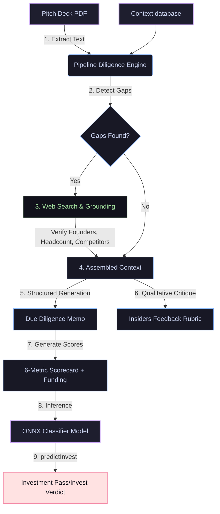

# SevenFold

<p align="center">
  
</p>

<h1 align="center">SevenFold</h1>

<p align="center">
  <strong>An AI-powered Venture Capital due diligence engine.</strong> Evaluates pitch decks, performs deep web research to verify claims, critiques decks using real accelerator rubrics, and runs scorecard metrics through an in-process trained ONNX machine learning model.
</p>

<p align="center">
  <a href="https://nextjs.org"></a>
  <a href="https://onnxruntime.ai"></a>
  <a href="https://typescriptlang.org"></a>
</p>

---

## How It Works

SevenFold is based on a real-life context database put together while reviewing **800+ pitch decks** at **Plug and Play Tech Center**, one of the world's most active accelerators. 


```mermaid
graph TD
    %% Styling
    classDef main fill:#1e1e2e,stroke:#cba6f7,stroke-width:2px,color:#cdd6f4;
    classDef highlight fill:#ffe2e2,stroke:#f38ba8,stroke-width:2px,color:#11111b;
    classDef process fill:#181825,stroke:#89b4fa,stroke-width:1px,color:#cdd6f4;
    classDef external fill:#11111b,stroke:#a6e3a1,stroke-width:1px,color:#a6e3a1;

    A[Pitch Deck PDF]:::main -->|1. Extract Text| B(Pipeline Diligence Engine):::process
    Playbook[Context database]:::main --> B
    
    B -->|2. Detect Gaps| C{Gaps Found?}:::process
    C -->|Yes| D[3. Web Search & Grounding]:::external
    D -->|Verify Founders, Headcount, Competitors| E[4. Assembled Context]:::process
    C -->|No| E
    
    E -->|5. Structured Generation| F[Due Diligence Memo]:::process
    E -->|6. Qualitative Critique| G[Insiders Feedback Rubric]:::process
    
    F -->|7. Generate Scores| Scorecard[6-Metric Scorecard + Funding]:::process
    Scorecard -->|8. Inference| ONNX[ONNX Classifier Model]:::main
    ONNX -->|9. predictInvest| Verdict[Investment Pass/Invest Verdict]:::highlight
```

---

## Key Features

*   **PDF Pitch Deck Parsing**
    Extracts core startup features, metrics, and team credentials from uploaded PDF pitch decks.
*   **Grounded Web Research**
    Uses Google Search grounding via Gemini to verify claims, search founder LinkedIn/GitHub profiles, assess competitive overlap, and fill missing deck parameters.
*   **Structured Due Diligence Report**
    Generates a full due diligence memo covering Company Identity, Founders & Cap Table, Team Runway, Problem & Insight, Solution Defensibility, and Market GTM.
*   **Feedback Rubric**
    Flags critical issues, warnings, and strengths (e.g., founder complementarity, full-time commitment, website discoverability, and realistic competitive maps) derived from real accelerator reviews.
*   **ONNX ML Scoring & Inference**
    Scores the startup on 6 metrics (Team, Tech, Market Size, Value Prop, Competition, Social Impact) and feeds them into an in-process, trained HistGradientBoosting classifier via `onnxruntime-node` to predict investment verdicts.
*   **Live Streaming Dashboard**
    An interactive dashboard that streams progress, search queries, research logs, and generated fields in real time using NDJSON.
*   **Real-time Cost Estimation**
    A Dev Cost Sidebar calculating prompt and completion token costs across model tiers (economy vs. reasoning/web-search passes) to monitor AI expenses.

---

## Context database & Custom ML Model

### 1. The context database
Instead of generic AI advice, SevenFold judges pitch decks against a strict, battle-tested accelerator template:
*   **Team Complementarity:** Evaluates whether there's a balanced split of engineering and business/domain expertise.
*   **Founder Commitment:** Highlights paths to full-time commitment and identifies part-time risks.
*   **Competitive Authenticity:** Penalizes startups claiming "no competition," looking for true differentiators.
*   **Discoverability:** Verifies if key founders are verifiable online (LinkedIn, publications, GitHub).
*   and more

### 2. ONNX Classifier
The investment verdict is determined by a **HistGradientBoosting** model trained on a historical database of 800+ evaluated deals. The model is exported to ONNX format (`lib/invest/model.onnx`) and run locally:
```typescript
// Features fed into model.onnx in exact order:
[
  TeamScore,            // 1-5
  TechnologyScore,      // 1-5
  MarketSizeScore,      // 1-5
  ValuePropScore,       // 1-5
  CompetitionScore,     // 1-5
  SocialImpactScore,    // 1-5
  FundingRaisedToDate   // Numeric integer
]
```

---

## Use it from Claude (MCP)

SevenFold is also a remote [MCP](https://modelcontextprotocol.io) server at `https://vcanalyst.williamragnarsson.dev/mcp`, so you can drop a deck into a Claude chat and get the full report back without opening the site. You sign in with your SevenFold account the first time, and every analysis lands in your history on the site as well.

**Claude (web / desktop):** Settings → Connectors → *Add custom connector* → paste the URL above → *Connect*, then sign in and approve.

**Claude Code:**
```bash
claude mcp add --transport http sevenfold https://vcanalyst.williamragnarsson.dev/mcp
```
Run `/mcp` once to sign in, then attach a deck and run `/mcp__sevenfold__analyze` (or just ask Claude to analyse it).

What the server offers:

| | |
|---|---|
| `analyze_deck` | Runs the full pipeline on a deck's text. Waits up to ~50 s with live progress, then hands back an `analysis_id` if the run is still going. Re-sending the same deck returns the saved report instead of paying for a second run (`rerun: true` forces one). |
| `get_analysis` | Waits for a run to finish (up to 50 s per call) and returns the report: verdict, scorecard, risks, strengths and a link to the full page. |
| `list_analyses` | Your recent analyses with their ids and links. |
| `analyze` prompt | The whole workflow in one step: transcribe the attached deck, run it, wait, summarise. |

**How the PDF gets there.** An MCP server never sees the files you attach in a chat. Claude reads the PDF itself, slides and images included, and sends the transcription as `deck_text`. The pipeline after that is the same one the site runs on an uploaded PDF.

**How sign-in works.** Supabase is the OAuth 2.1 authorization server: Claude registers itself, sends you to Supabase, and Supabase sends you to `/oauth/consent` on this site to approve. The access token it hands Claude is a normal Supabase user token, so every tool call runs under your account with the same Row-Level Security as the website, minus deleting and access to uploaded PDFs (`supabase/migrations/0002_oauth_clients.sql`). The server publishes where to sign in at `/.well-known/oauth-protected-resource/mcp`.

---

## Tech Stack

- **Framework**: [Next.js 16](https://nextjs.org/) (App Router, Tailwind CSS v4)
- **AI Models**: 
  - [Google Gemini API](https://ai.google.dev/) (via `@google/genai` for web-grounded research)
  - [Anthropic Claude API](https://anthropic.com/) (via `@anthropic-ai/sdk` for structured memo writing)
- **ML Runtime**: [ONNX Runtime Node](https://onnxruntime.ai/) (`onnxruntime-node`)
- **PDF Processor**: `unpdf` (using PDF.js underneath for fast server-side text extraction)

---

## Setup & Installation

### 1. Prerequisites
Make sure you have Node.js (v18+) and your API keys ready.

### 2. Clone the Repository
```bash
git clone https://github.com/william-popmie/vc-analyst.git
cd vc-analyst
```

### 3. Configure Environment Variables
Create a `.env` file in the root directory (you can copy `.env.example`):
```bash
# LLM Provider Configuration
WRITER_PROVIDER=claude
RESEARCH_PROVIDER=gemini

# API Keys
ANTHROPIC_API_KEY=your_claude_api_key
GEMINI_API_KEY=your_gemini_api_key
```

### 4. Install Dependencies
```bash
npm install
```

### 5. Run the Dev Server
```bash
npm run dev
```
Open [http://localhost:3000](http://localhost:3000) with your browser to see the app.

---

<p align="center">Last updated: August 2026.</p>
